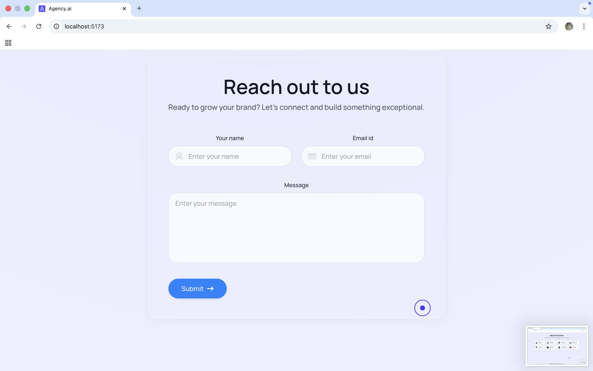

# Agency AI — Modern Marketing Landing Page (React + Tailwind)

A modern interactive landing page built with React, Tailwind CSS, custom cursor interactions, parallax animated background, and dark mode.

## ✨ Features

- 🎨 Modern SaaS-style UI
- 🌓 Light / Dark mode with persistent state
- 🖱️ Custom animated cursor (dot + ring)
- 🌌 Parallax animated background bubbles
- 📱 Fully responsive layout
- 🧩 Smooth section scroll navigation
- 📬 Contact form
- 👨‍👩‍👧 Team & Services sections
- 🌐 SEO-friendly structure
- 🧱 Clean component architecture

-----------------

## 🖼️ Preview Screenshots

<div align="center">


<br/>



<br/>


</div>


-----------------

## 🚀 Live Demo

Soon......

---

## 📦 Installation & Setup

## Clone the repo:

```sh
git clone https://github.com/salluexez/agency-ai 
```

## Move into projects:

```sh
cd your-repo
```

## After that Install dependencies:

```sh 
npm install
```

## Run development server:

```sh
npm run dev
```

## Build for production:

```sh 
npm run build
```

## Preview production build:

```sh 
npm run preview
```


## Project Structure ---

src/
 ├── components/
 │    ├── Navbar.jsx
 │    ├── Menu.jsx
 │    ├── InnerPage.jsx
 │    ├── LatestWork.jsx
 │    ├── Help.jsx
 │    ├── Team.jsx
 │    ├── ReachOut.jsx
 │    ├── Footer.jsx
 │    └── CustomCursor.jsx
 ├── assets/
 │    ├── icons & images ...
 ├── store/
 │    └── ThemeStore.js
 ├── App.jsx
 └── main.jsx


## Contributing----------

Pull requests are welcome....

---------


## 👥 Contributors

Thanks to all who contributed to this project!

<a href="https://github.com/salluexez">
  
</a>

<a href="https://github.com/ArushKhasru">
  
</a>

---

### Special Thanks 🤝

- **[@salluexez](https://github.com/salluexez)** — Core Development
- **[@ArushKhasru](https://github.com/ArushKhasru)** — UI/Brainstorming Support

-------


